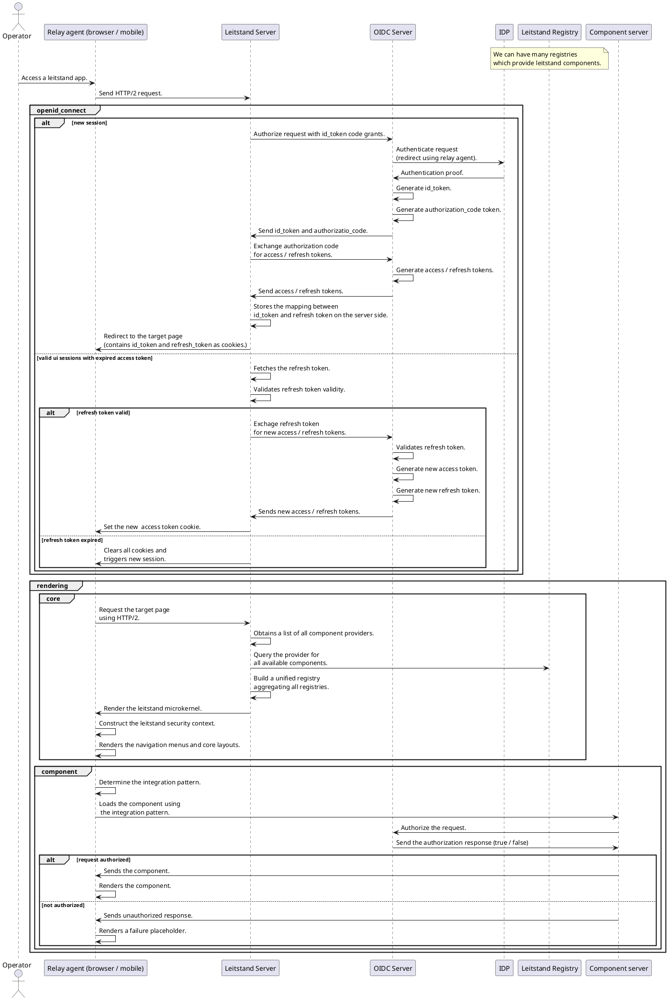

In  this document you can find all th relevant details about how leitstand platform rendering engine works.

# Abstract

The leitstand platform acts as a distributed rendering engine for multiple UI components. It supports various integration patterns:

1. Trusted components.
1. Untrusted components.

The components supported by leitstand can be developed using:

1. Native leitstand framework.
1. Web components.

# Technical summary

The diagram below can you also be found as [image](images/rendering.png).

The following diagram assumes the following requirements are provided by leitstand server:

1. Durable fast storage for managing the tokens.
1. Discovery process for all components registries.
1. Management APIs for controlling the components and required permissions. This is a must in order to avoid deploying the leitstand server every single time we add a new component.
1. Leitstand microkernel capable of maintaining a security context on the client side.
1. Every component loaded can communicate with the leitstand microkernel for:
    1. Accessing the security context.
    1. Retrieving user preferences.
    1. Retrieving user details.
1. Leitstand server provides a clean way to define themes for components, menus and layouts.
1. Leitstand microkernel provides adapters for making it usable from various frameworks:
    1. Leitstand native components.
    1. Polymer webcomponents.
    1. React applications.
    1. AngularJS applications.