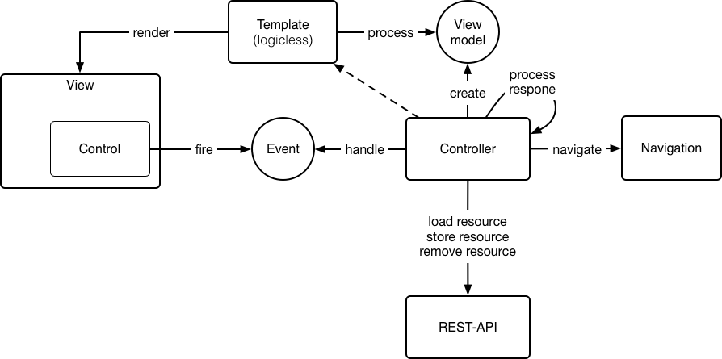
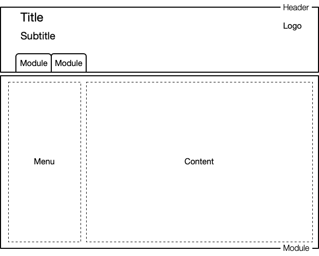
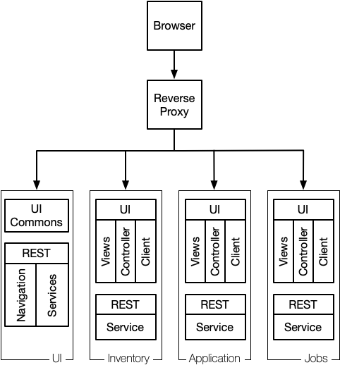

# Leitstand User Interface

The Leitstand UI is implemented as single-page application and operates on the REST-APIs provided by Leitstand modules and applications.

## Model View Controller
The Leitstand UI obeys the Model-View-Controller pattern as illustrated below.

 

The [controllers](controller.md) form the centerpieces of the UI. 
A controller invokes the [REST-API](resources.md), translates the server-side resource into the view model, 
passes the view model to the [view template](templates.md) to render the view and 
processes all events fired from controls on the view.
In addition, the controller consults the navigation in order to proceed to a different view.

The following tutorials provide a brief introduction on how to implement Leitstand UI views:

- The [List View Tutorial](listview_tutorial.md) explains how to implement a list view.
- The [Detail View Tutorial](details_tutorial.md) explains how to implement a form to manage object settings.
- The [Add Tutorial](add_tutorial.md) explains how to add a new entity to an entity collection.

## UI Modules
The UI consist of modules. 
Each tab in the main menu represents a module.
A module has full control of the screen real estate below the main menu tabs. 

 

Controllers, view templates, and client libraries are located in the same git repository as the REST service implementation.
Consequently UI and REST services receive the same version tags which helps to avoid compatibility issues.

The UI server hosts common UI resources, like the UI javascript libraries, the CSS files, error pages, login form, as well as the [main menu configuration and module descriptors](modules.md). 

 

The browser forms the integration platform of the Leitstand UI and loads needed resources on demand.
The following sequence initializes the Leitstand UI:
1. The browser loads the UI foundation libraries and CSS files.
2. The browser prompts the user for credentials.
3. The browser loads the main menu configuration and renders the main menu.
4. The browser loads the module descriptor for the first module being displayed.
5. The browser processes the module descriptor and registers the module menu in the main menu.
6. The browser loads all resources to display the module welcome page.

A UI module can assemble views from different containers.
This is the reason why module descriptors are loaded from the UI server rather than from the container.

## Error Handling and Input Validation
The [Leitstand UI error handling](errors.md) relies on the status messages returned by the REST API.

## Authentication and Authorization
The Leitstand UI uses a role-based authorization model.
The authentication process returns a list of roles assigned to the authenticated user.
The UI allows only operations when the user has any of the required roles.

## Technology Stacks and Frameworks
The UI is implemented in vanilla ES6 and makes use of ES6 language features like modules, classes and asynchronous function, Promises and the await keyword. The component library is implemented as HTML web components.
The Primer CSS Framework is used to style the Leitstand UI.