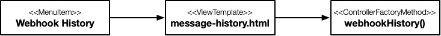
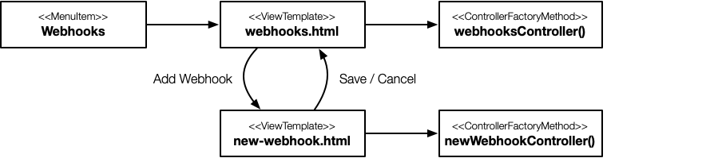

# Leitstand UI Controller

The controller invokes the REST API, 
translates the response entity into the view model, 
passes the view model to the view template in order to render the view and 
subscribes all events from the view to process them accordingly.

Leistand UI controllers are bundled in ES6 _modules_.
A module provides a controller for each view and creates a menu to bind every view to its controller. 
The menu is exported to get registered in the Leitstand menu.

`Controller` and `Menu` are supplied by the Leitstand UI API library (`/ui/js/ui.js`).

## Controller

The `Controller` class provides the controller functionality and is parameterized by a single JSON object representing the controller configuration.
The minimal configuration consists merely of the [resource](resources.md) the controller should invoke.
A typical controller configuration contains the following properties:
- `resource`, the main `Resource` the controller is operating on. The controller invokes the `load` method of the declared resource to initialize the view. 
- `viewModel`, an optional callback to translate the resource entity into the view model.
- `postRender`, an optional callback to augment the rendered view with additional information (e.g. augment an interface list with telemetry data from a time series database).
- `buttons`, an optional associative array of callback functions to handle button click events. The button name is used as key, the callback function to handle the click is the array value.
- `onSuccess`, `onRemoved`, `onCreated` event handlers to process the outcome of a successful REST API invocation.

The controller configuration is bound to the `Controller` instance.
By that the controller configuration has access to the convenience methods provided by the `Controller`.
The most frequently controller methods are
- `this.location` to read the current location including query parameters.
- `this.getViewModel` to read the view model and extract the data to be passed to the REST API.
- `this.navigate` to navigate to a different view.
- `this.reload` to reload the current view.
- `this.input` to access an input element.
- `this.element` to access an arbitrary element.

More details about the `Controller` methods, the Leitstand DOM API and the configuration object can be found in the Leitstand JSDoc.

A controller is created by a factory method.
The factory method creates the resource and the view controller.

The listing below shows the factory method for the controller of the webhook list view.

```ES6
// Import controller and menu rom the UI API
import {Controller,Menu} from '/ui/js/ui.js';

let webhooksController = function() {
  let hooks = new Webhooks();
  return new Controller({
    resource:hooks,
    viewModel:function(hooks){
      return {'hooks':hooks,
              'state':function(){
                  return this.enabled ? 'UP' : 'DOWN';
              },
              'filter':this.location().param('filter')};
    },
    buttons:{
      'filter':function(){
        this.reload({'filter':this.getViewModel('filter')});
      }
    }  
  });
};
```
The controller instantiates the Webhooks [resource](resources.md) and creates the controller.
The view model contains the returned hooks, 
a mapping function to translate the `enabled` flag into a state with values `UP` or `DOWN`,
and the currently applied filter.
Moreover, the controller has an event handler refreshing the view whenever a new filter was applied.

## Menu
The menu assigns a view template to its controller and registers the controller in the Leitstand menu.
The menu needs to be _exported_ in order to get registered in the overall Leitstand menu.

```ES6
export const menu = new Menu(...);
```

The menu differentiates between _single_ views and _master-detail_ views.

### Single View
A menu entry of a single view consists of the view template as key and the controller as value.

```ES6
export const menu = new Menu('message-history.html':webhookHistory());
```
The view is accessible through the menu item configured in the [module descriptor](module.md).

 


### Master Detail Page
A master-detail view is formed by a master page and an arbitrary number of detail pages. 
A detail page can either have its own controller or use the controller of the master page.

A menu entry of a master-detail view uses the master-view template as key and a descriptor object of the master-detail pages as value.
The master-detail page descriptor has `master` and a `detail` property.
The `master` property contains the controller of the master view.
The `detail` property is an associative array with the detail view template as key and the controller of the detail view as value. 

```ES6
let webhooksView = {
  'master':webhooksController(),
  'details':{'new-webhook.html':newWebhookController()}
};

export const menu = new Menu({'webhooks.html':webhooksView});
```

 

The master view is accessible through the menu item. 
The detail views are accessible from the master view, without changing the focused menu item.