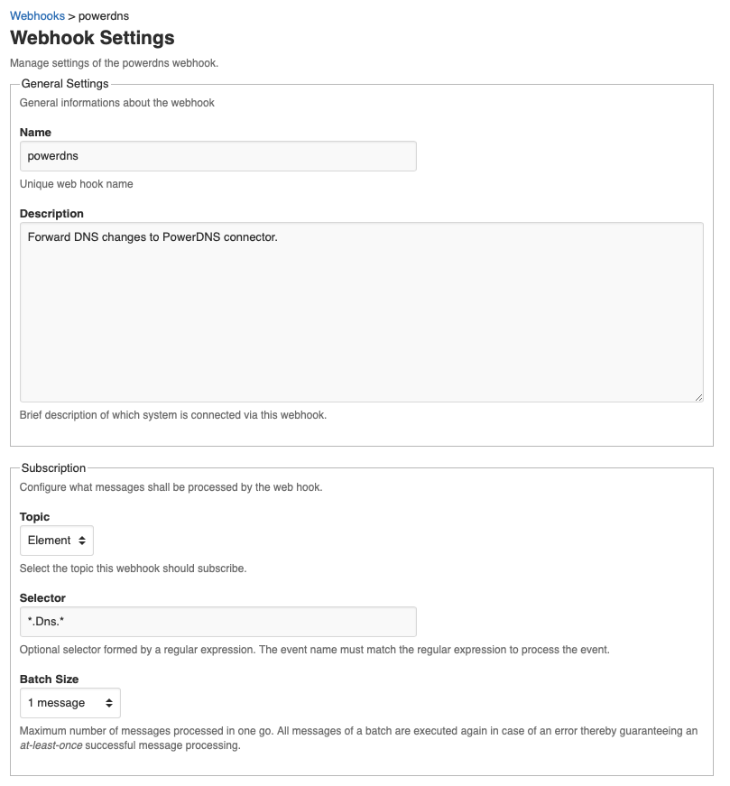
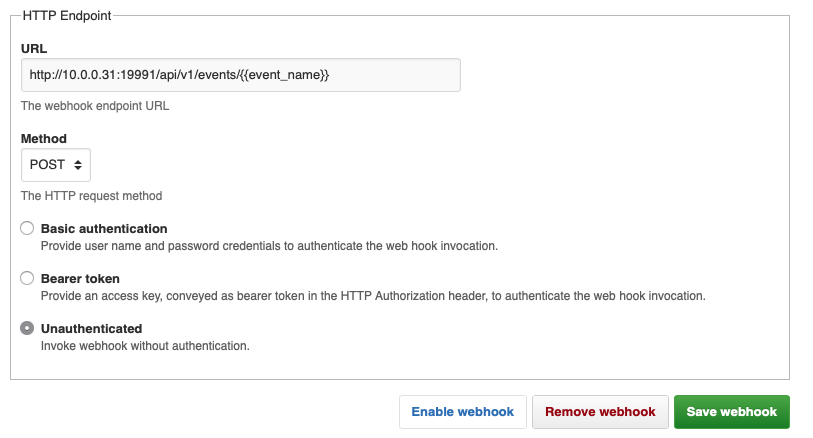

# Manage Entity Tutorial

This tutorial is the second of a series of tutorials that explains how to extend the Leitstand UI.
The [first tutorial](listview_tutorial.md) explained how to display a list of entities, using the webhooks list view as an example. 
The [second tutorial](add_tutorial.md) covered how to add a new entity.
This tutorial outlines how to manage an existing entity. 

 
 


## Webhook Resource

The `Webhook` resource provides access to the webhook management REST API endpoint.
The webhook REST API endpoint supports reading a webhook configuration, updating a webhook configuration, removing a webhook configuration, enabling or disabling a webhook and also to reset a webhook to process a certain domain event and all subsequent domain events again.

```ES6
/**
 * A configured webhook.
 * <p>
 * This class provides methods to store, remove, and manage the state of a configured webhook.
 */
export class Webhook extends Resource {
  
  /**
   * Creates a <code>Webhook</code> resource.
   * @param {string} [cfg.scope] the scope being read, which is either <code>settings</code> or <code>template</code>
   */
  constructor(cfg) {
    super()
    this._cfg = cfg;
  }
  
  /**
   * Reads the webhook configuration.
   * @param {String} params.hook the hook ID or the hook name
   * @returns {Promise} a promise to process the REST API response
   */
  load(params) {
    return this.json("/api/v1/webhooks/{{hook}}/{{scope}}",
                     this._cfg,
                     params)
               .GET();
  }

  /**
   * Stores the webhook configuration.
   * @param {String} params.hook the hook ID or the hook name
   * @param {WebhookSettings} settings the webhook settings.
   * @returns {Promise} a promise to process the REST API response
   */
  saveSettings(params,settings){
    return this.json("/api/v1/webhooks/{{hook}}/{{scope}}",
                     this._cfg,
                     settings,
                     params)
               .PUT(settings);
  }
  
  /**
   * Removes a webhook.
   * @param {Object} params the query parameters
   * @returns {Promise} a promise to process the REST API response
   */
  removeHook(params){
    return this.json("/api/v1/webhooks/{{hook}}",
                     this._cfg,
                     params)
               .DELETE();
  }

  /**
   * Enables a configured webhook.
   * This operation has no effect when executed on already enabled webhooks.
   * @param {String} params.hook the hook ID or the hook name
   * @returns {Promise} a promise to process the REST API response
   */
  enableHook(params){
    this.json("/api/v1/webhooks/{{hook}}/_enable",
              this._cfg,
              params)
        .POST();
  }
  
  /**
   * Disables a configured webhook.
   * This operation has no effect when executed on already disabled webhooks.
   * @param {String} params.hook the hook ID or the hook name
   * @returns {Promise} a promise to process the REST API response
   */
  disableHook(params){
    return this.json("/api/v1/webhooks/{{hook}}/_disable",
                     this._cfg,
                     params)
               .POST();
  }
  
  /**
   * Resets a configured webhook to process a domain event and all subsequent events again.
   * @param {String} params.hook the hook ID or the hook name
   * @param {String} params.event_id the domain event in the message queue to reset the webhook to
   * @returns {Promise} a promise to process the REST API response
   */
  resetHook(params){
    return this.json("/api/v1/webhooks/{{hook}}/_reset?event_id={{event_id}}",
                     this._cfg,
                     params)
               .POST();
  }
    
}
```

## View Template
The view template renders a form to configure the webhook.
It provides input fields to modify all webhook properties and buttons to save, remove, or switch the state of a button.

```HTML
<ui-view-header>
  <ui-breadcrumbs>
    <ui-breadcrumb href="webhooks.html">Webhooks</ui-breadcrumb>
    <ui-breadcrumb>{{hook.hook_name}}</ui-breadcrumb>
  </ui-breadcrumbs>
  <ui-title>Webhook Settings</ui-title>
  <ui-subtitle>Manage settings of the {{hook.hook_name}} webhook.</ui-subtitle>
</ui-view-header>
<ui-form rolesAllowed="Administrator">
  <ui-group>
    <ui-label>General Settings</ui-label>
    <ui-note>General informations about the webhook</ui-note>
    <ui-input name="hook_name" bind="hook.hook_name">
      <ui-label>Name</ui-label>
      <ui-note>Unique web hook name</ui-note>  
    </ui-input>
    <ui-textarea name="description" bind="hook.description">
      <ui-label>Description</ui-label>
      <ui-note>Brief description of which system is connected via this webhook.</ui-note>  
    </ui-textarea>  
  </ui-group>
  <ui-group>
    <ui-label>Subscription</ui-label>
    <ui-note>Configure what messages shall be processed by the web hook.</ui-note>
    <ui-select name="topic_name" options="topics" bind="hook.topic_name">
      <ui-label>Topic</ui-label>
      <ui-note>Select the topic this webhook should subscribe.</ui-note>
    </ui-select>
    <ui-input name="selector" bind="hook.selector">
      <ui-label>Selector</ui-label>
      <ui-note>Optional selector formed by a regular expression. The event name must match 
               the regular expression to process the event.</ui-note>
    </ui-input>
    <ui-select name="batch_size" options="batch_sizes" bind="hook.batch_size">
      <ui-label>Batch Size</ui-label>
      <ui-note>Maximum number of messages processed in one go. All messages of a batch are 
               executed again in case of an error thereby guaranteeing an <em>at-least-once</em> 
               successful message processing.</ui-note>
    </ui-select>
  </ui-group>
  <ui-group>
    <ui-label>HTTP Endpoint</ui-label>
      <ui-input name="endpoint" bind="hook.endpoint">
        <ui-label>URL</ui-label>
        <ui-note>The webhook endpoint URL</ui-note>
      </ui-input>
      <ui-select name="method" bind="hook.method" options="http_methods">
        <ui-label>Method</ui-label>
        <ui-note>The HTTP request method</ui-note>
      </ui-select>
      <ui-radio name="auth_mode" value="basic">
        <ui-label>Basic authentication</ui-label>
        <ui-note>Provide user name and password credentials to authenticate the web hook invocation.</ui-note>
      </ui-radio>
      <ui-radio name="auth_mode" value="bearer">
        <ui-label>Bearer token</ui-label>
        <ui-note>Provide an access key, conveyed as bearer token in the HTTP Authorization header, 
                 to authenticate the web hook invocation.</ui-note>
      </ui-radio>
      <ui-radio name="auth_mode" default>
        <ui-label>Unauthenticated</ui-label>
        <ui-note>Invoke webhook without authentication.</ui-note>
      </ui-radio>
  </ui-group>
  <ui-group when="basic_auth">
    <ui-label>Basic Authentication</ui-label>
      <ui-input name="user_id" bind="hook.user_id">
        <ui-label>User</ui-label>
        <ui-note>Webhook user login ID</ui-note>                
      </ui-input>
      <ui-password name="password" bind="hook.password">
        <ui-label>Password</ui-label>
        <ui-note>Password to authenticate the user</ui-note>
      </ui-password>
      <ui-password name="confirm_password" bind="hook.confirm_password">
        <ui-label>Confirm password</ui-label>
        <ui-note>Enter password again in order to detect accidential typos.</ui-note>
      </ui-password>
  </ui-group>
  <ui-group when="bearer_auth">
    <ui-label>Bearer Token</ui-label>  
    <ui-textarea name="accesskey" bind="hook.accesskey">
      <ui-label>Access Key</ui-label>
      <ui-note>Access key to authenticat the webhook invocation</ui-note>
    </ui-textarea>
  </ui-group>
  <ui-actions>
    <ui-button name="save-settings" primary>Save webhook</ui-button>
    <ui-button href="confirm-remove.html?hook={{hook.hook_id}}">Remove webhook</ui-button>
    <ui-button name="disable-webhook" when="enabled">Disable webhook</ui-button>
    <ui-button name="enable-webhook" when="disabled">Enable webhook</ui-button>
  </ui-actions>
</ui-form>
```
The webhook settings are bound to the `hook` property of the view model. 
This allows the controller to introduce additional properties conveying the options for the declared selectboxes:
- the `http_methods` view model property contains the list of supported HTTP methods,
- the `topics` view model property contains the list of existing topics, and
- the `batch_sizes` view model property contains the list of supported batch sizes.
The controller submitts only the `hook` property to the REST API.

The _Disable webhook_ and the _Enable webhook_ buttons are _conditional_ and only enabled when the webhook is in the opposite state each (`when`)

The _Remove webhook_ redirect the user to a confirm dialog rather than removing the webhook (`href`).

 


```ES6
<ui-confirm>
  <ui-title>Confirm to remove webhook {{hook.hook_name}}</ui-title>
  <ui-message>
    Removing a webhook <strong>cannot be undone!</strong> 
    The configured service endpoint gets no longer notified about subscribed events once the webhook has been removed.
  </ui-message>
  <ui-approve name="remove-webhook">Confirm</ui-approve>
  <ui-decline href="webhook.html?hook={{hook.hook_id}}">Decline</ui-decline>
</ui-confirm>
```


The controller processes the confirmation and removes the webhook. 

## Controller
The controller translates the settings to the view model. 
The view model contains the web hook settings and the list of existing topics, supported HTTP methods, and supported batch sizes.
Both are needed to render the select boxes.
The controller also determines the authentication mode being used and sets the radio button to switch between authentication modes to the correct value.


```ES6
let webhookController = function(){
  let hook = new Webhook();
  return new Controller({
    resource:hook,
    viewModel:function(settings){ 
      let viewModel = {'http_methods':HTTP_METHODS,
                       'topics':TOPICS,
                       'batch_sizes':BATCH_SIZES,
                       'hook':settings};
      viewModel.basic_auth = function(){
        return this.auth_mode == 'basic';
      };
      viewModel.bearer_auth = function(){
        return this.auth_mode == 'bearer';
      };

      // Set current auth mode
      if(settings.accesskey){
        viewModel.auth_mode = 'bearer';
      } else if (settings.user_id){
        viewModel.auth_mode = 'basic';
      }
      
      // Set current state
      viewModel.enabled = function(){
        return settings.enabled;
      }
      viewModel.disabled = function(){
        return !settings.enabled;
      }
      return viewModel;
    },
    buttons:{
      'save-settings':function(){
        let settings = this.getViewModel('hook');
        let authmode = this.getViewModel('auth_mode');
        if(authmode != 'basic'){
          delete settings.user_id;
          delete settings.password;
          delete settings.cofirm_password;
        } 
        if (authmode != 'bearer'){
          delete settings.accesskey;
        }
        hook.saveSettings(this.location().params(),
                  settings);
          
      },
      'remove-webhook':function(){
        hook.removeHook(this.location().params());
      },
      'disable-webhook':function(){
        hook.disableHook(this.location().params());
      },
      'enable-webhook':function(){
        hook.enableHook(this.location().params());
      },
      'confirm-remove':function(){
        this.navigate({'page':'confirm-remove.html',
                 '?':this.location().params()});
      }
    },
    onSuccess:function(){
      this.navigate('webhooks.html');
    }
  });
}
```

The final step is to register the controller and both views in the menu.

```ES6
let webhooksView = {
  'master':webhooksController(),
  'details':{'new-webhook.html':newWebhookController()}
};

let webhookView = {
	'master':webhookController(),
	'details':{'confirm-remove.html':webhookController()}
};

export const menu = new Menu({'webhooks.html':webhooksView,
						    'webhook.html':webhookView});


