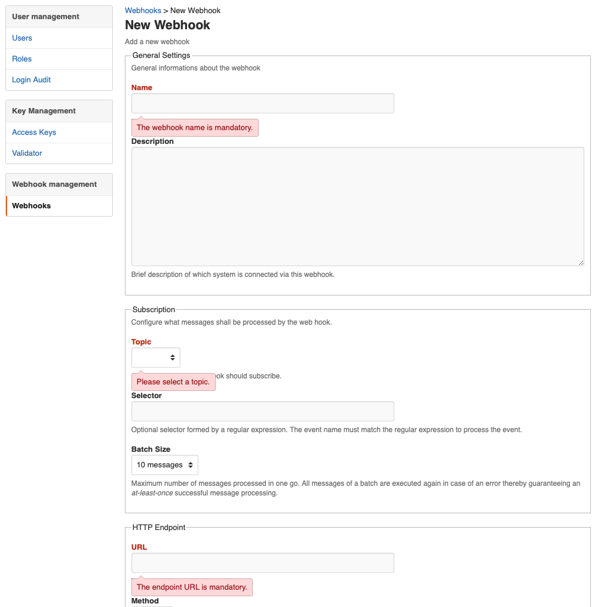
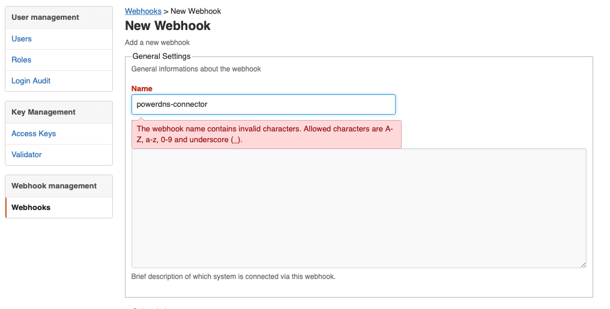
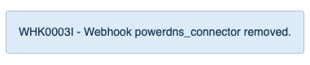

# Leitstand UI Error Handling


The Leistand UI error handling relies on the HTTP status code and status messages returned by the REST API. 
The REST API uses the HTTP Status Code in combination with optional status messages to explain the outcome of an API invocation. A status message is a JSON object and contains the following attributes:

- `severity`, the message severity which is either `ERROR`, `WARNING`, or `INFORMATION`.
- `reason`, a unique, 8-digit reason code which allows to understand why the message was created.
- `message`, the status details in a human-friendly format
- `property`, an optional property name which is set when the message is related to a property of the request entity.
- `value`, the value of the request entity property the `property` attribute refers to.

## Input Error
The Leitstand UI tries to find a matching input field if the `property` property is present.
The discovered input field is highlighted, focused and the error messages is displayed next to the input field.

The listing below shows error messages returned by Leitstand along with a `422 Unprocessable Entity` status code when attempting to create a webhook without providing any data.  
 
```JSON
[{
    "severity": "ERROR",
    "reason": "VAL0001E",
    "message": "The webhook name is mandatory.",
    "property": "hook_name"
}, {
    "severity": "ERROR",
    "reason": "VAL0001E",
    "message": "The endpoint URL is mandatory.",
    "property": "endpoint"
}, {
    "severity": "ERROR",
    "reason": "VAL0001E",
    "message": "Please select a topic.",
    "property": "topic_name"
}]
```

The service reported three errors stating that three required properties are missing.
The Leitstand UI discovers the input fields for the missing properties and displays the error message accordingly. 



The next listing shows an example of an incorrect rather than a missing value.

```JSON
[{
    "severity": "ERROR",
    "reason": "VAL0002E",
    "message": "The webhook name contains invalid characters. Allowed characters are A-Z, a-z, 0-9 and underscore (_).",
    "property": "hook_name",
    "value": "powerdns-connector"
}]
```




## Flash Messages
All other messages, which cannot be assigned to an input field, are displayed as flash messages,
with different coloring per message severity.

The listing below shows an informal message that a webhook has been removed.

```JSON
[{
    "severity": "INFO",
    "reason": "WHK0003I",
    "message": "Webook powerdns_connector removed."
}]
```




## Customized Error Handling
Each controller can replace the default event handlers by custom event handlers in order to implement a custom error handling. 
See the [controller documentation](controller.md) for further information.


