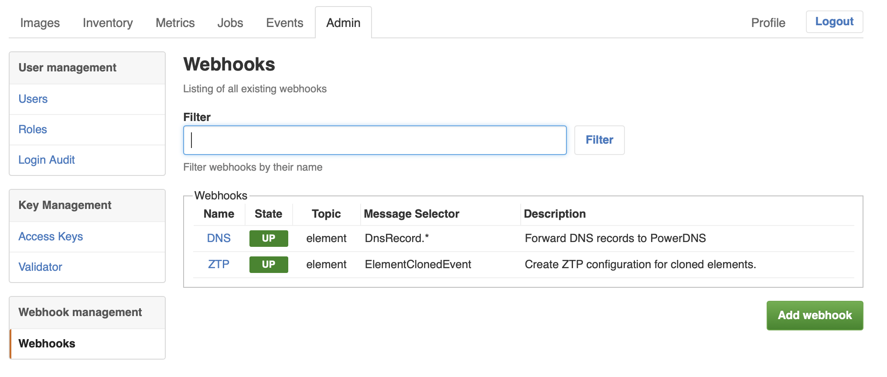
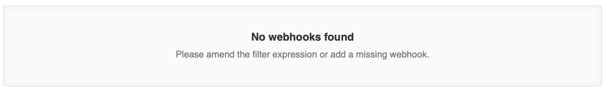

# List View Tutorial

This tutorial is the first of a series of tutorials that explains how to extend the Leitstand UI.
This tutorial discusses how to add a list view. The next tutorials explain how to add new entity to resource collection, edit and existing resource and remove a resource.

The tutorial is based on the Leitstand webhook management UI and explains the implementation of the webhook list shown below:

 

All code listings are taken from the Leitstand UI.

Recalling the model view controller pattern, the UI is formed by
- a client to load the resource and translate it to the view model
- a view template
- a controller to render the view and handle all events.

## Webhooks Resource
The first step is to implement a client to access the webhooks resource through the REST API.
The webhooks resource endpoint is `/api/v1/webhooks` and accepts an optional `filter` parameter to query webhooks by their name.

```ES6
/**
 * Collection of configured webhooks.
 */
export class Webhooks extends Resource {

  /**
   * Loads all configured webhooks
   * @returns {Promise} a promise to process the webhook collection or an error response
   * @see WebhookReference
   */
  load(params) {
    return this.json('/api/v1/webhooks?filter={{filter}}',
				    params)
               .GET();
  }

  /**
   * Adds a new webhook.
   * @param {WebhookSettings} settings the webhook settings
   */
  addHook(settings){
    return this.json("/api/v1/webhooks/")
               .POST(settings);
  }

}

```

The REST API returns a list of webhook references. Each reference contains
- the webhook ID
- the webhook name
- an optional webhook description
- a flag indicating whether the webhook is enabled
- the subscribed topic and the event selector

```JSON
[{"webhook_id":"03bd6e00-1042-4422-bb15-283a6825db07",
  "webhook_name":"DNS",
  "description":"Forward DNS records to PowerDNS",
  "topic":"element",
  "selector":"DnsRecord.*",
  "enabled":true},
 {"webhook_id":"8c697515-e0a9-460d-95c3-afc99c406341",
  "webhook_name":"ZTP",
  "description":"Create ZTP configuration for cloned elements.",
  "topic":"element",
  "selector":"ElementClonedEvent",
  "enabled":true}]
```

## View Template
The view template translates the webhook references into a table or displays a blankslate if no webhooks exists.

Leitstand UI templates are Mustache templates and use the Leitstand component library.
Mustache is a logic-less template engine, which means that mustache only allows to iterate through the object model. 
A template section is omitted, if a property is `undefined`, `null`, `false`, or `0`.


```HTML
<ui-view-header>
  <ui-title>Webhooks</ui-title>
  <ui-subtitle>Listing of all existing webhooks</ui-subtitle>
</ui-view-header>
<ui-form rolesAllowed="Administrator">
  <ui-filter name="filter">
    <ui-label>Filter</ui-label>
    <ui-note>Filter webhooks by their name</ui-note>
  </ui-filter>
  <!--  {{#hooks.length}} -->
  <ui-group>
    <ui-label>Webhooks</ui-label>
    <table class="list">
      <thead>
        <tr>
          <th>Name</th>
          <th>State</th>
          <th>Topic</th>
          <th class="text">Message Selector</th>
          <th class="text">Description</th>
        </tr>
      </thead>	
      <tbody>
        <!-- {{#hooks}} -->
        <tr>
          <td><a href="webhook.html?hook={{hook_id}}" title="View hook settings">{{hook_name}}</a></td>
          <td><span class="{{state}}">{{state}}</span></td>
          <td>{{topic_name}}</td>
          <td class="text">{{selector}}</td>
          <td class="text">{{description}}</td>
        </tr>	
        <!--  {{/hooks}}-->
      </tbody>
    </table>
  </ui-group>
  <!--  {{/hooks.length}} -->
  <!--  {{^hooks}} -->
  <ui-blankslate>
    <ui-title>No webhooks found</ui-title>
    <ui-subtitle>Please amend the filter expression or add a missing webhook.</ui-subtitle>
  </ui-blankslate>
  <!--  {{/hooks}} -->
  <ui-actions>
    <ui-button href="new-webhook.html" primary rolesAllowed="Administrator">Add webhook</ui-button>
  </ui-actions>
</ui-form>
```
First the view header, including view title and subtitle, is declared, followed
by a filter (`<ui-filter...>` component) for filtering the displayed the webhook list items.
Next, the template declares a table to list all webhooks and creates a table row per hook (`{{#hooks}}...{{/hooks.length}}`), if the `hooks` array in the view model is not empty (`{{#hooks.lenth}}..{{/hooks.length}}`)
The `#` walks down the object hierarchy and creates a new context to read the properties from. 
If the specified property is an array, the section is executed for each array item.
The template renders a blankslate if the `hooks` array is empty or does no exist.

 

The Mustache instructions are put into HTML comments to preserve a valid HTML syntax.

## Controller
The controller accesses the `Webhooks` resource, translates the resource into a view model and renders the view.
The view model consists of three properties:
- the `hooks` array contains all existing webhooks
- the `state` function translate the `enabled` flag to a human-friendly name
- the `filer` string contains the currently applied filter.
Moreover, the controller implements the filter function, that applies the current filter to the list view by means of reloading the view with the new filter expression.

```ES6
let webhooksController = function() {
  let hooks = new Webhooks();
  return new Controller({
    resource:hooks,
    viewModel:function(hooks){
      return {'hooks':hooks,
              'state':function(){
                return this.enabled ? 'UP' : 'DOWN';
              },
              'filter':this.location().param('filter')};
    },
    buttons:{
      'filter':function(){
        this.reload({'filter':this.input('filter').value()});
      }
    }
  });
};
```
The final step is to register the controller in the module menu. 
The webhooks view is a master-detail view.
The master page lists all existing webhooks.
The detail page allows to add new webhooks.


```ES6
let webhooksView = {
  'master':webhooksController(),
  'details':{'new-webhook.html':newWebhookController()}
};

```

Therefore, the `webhooks.html` template is bound to the webhooks view declaration. 

```ES6

export const menu = new Menu({'webhooks.html':webhooksView});							  
```

The next tutorial discusses [how to add a new webhook](./add_tutorial.md).							  